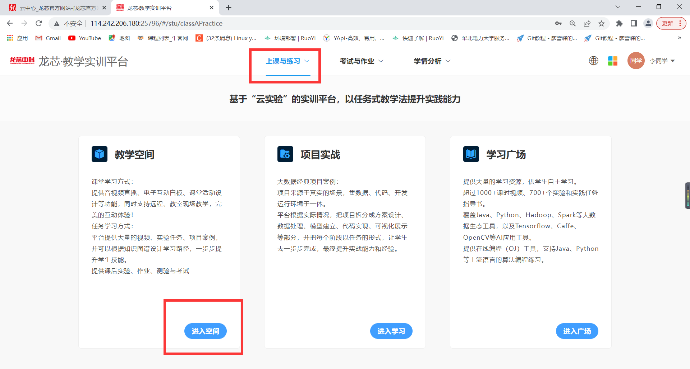

# 实训平台使用手册
- 龙芯云中心网址  http://www.loongsoncloud.cn/

### 龙芯直播课堂
- 进入方式1 网址 http://114.242.206.180:24857/course/
- 进入方式2 点击龙芯云中心首页右上册[龙芯直播课堂]进入

<table>
   <tr>
      <td></td>
   </tr>
</table>

- 进入龙芯师资班，登录报名后点击
<table>
   <tr>
      <td></td>
   </tr>
   <tr>
      <td></td>
   </tr>
   <tr>
      <td></td>
   </tr>
</table>

### 教学实训平台
- 进入方式1：网址 http://114.242.206.180:25796/#/Login
- 进入方式2：进入方式2 点击龙芯云中心首页右上册[教学实训平台]进入登录页面，输入账号登录

<table>
   <tr>
      <td></td>
   </tr>

</table>

- 进入实训平台首页，点击[教学空间]下方[进入空间]
<table>

   <tr>
      <td></td>
   </tr>

</table>

- 进入教学空间首页，选择可申请空间
<table>

   <tr>
      <td></td>
   </tr>

</table>

- 分别选择选择刘老师、付老师、何老师的教学空间加入
- 加入教学空间后点击教学空间1进入，点击任务课程进入即可看到课程
<table>
   <tr>
      <td></td>
   </tr>
</table>
<table>
   <tr>
      <td></td>
   </tr>
</table>

- 选择相应课程点击进入学习即可进入实训平台虚拟机界面
<table>
   <tr>
      <td></td>
   </tr>
</table>